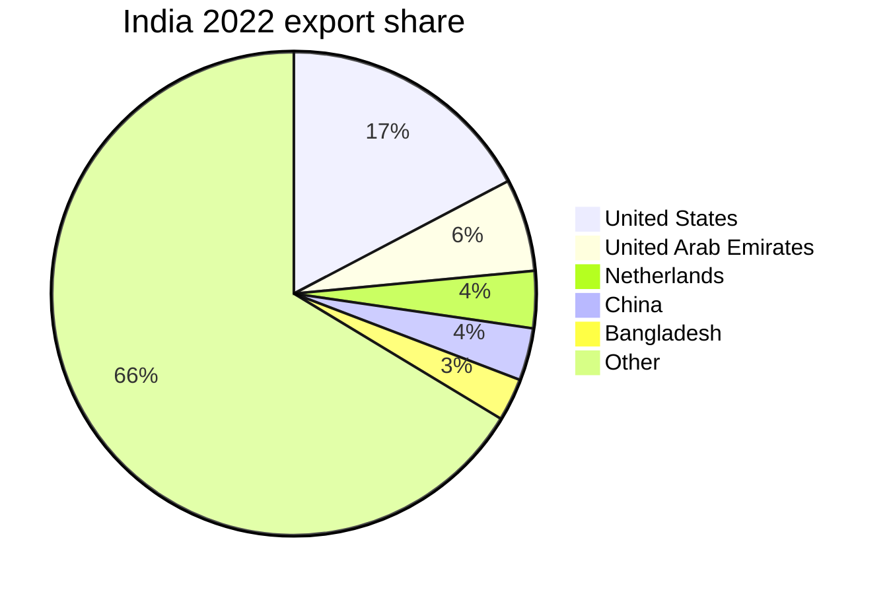

# Reporting

The reporting workflow turns analytics output into **shareable
artefacts**: Markdown tables, CSV files, Parquet snapshots, or HTML
reports. The SDK provides first-class Markdown output through the
`--output-format markdown` CLI flag, and a small set of
`CanonicalDataset` helpers for ad-hoc Python rendering.

## Purpose

This page covers:

1. Markdown table generation from analytics output.
2. CSV and Parquet snapshot pipelines.
3. Composing multi-section reports.
4. Embedding Mermaid diagrams for trend visualisation.

## Prerequisites

- `un-comtrade-sdk[all]` installed (Parquet for snapshots).
- Familiarity with the analytics layer
  (see **[Python SDK → Analytics][python-analytics]**).

## Walkthrough

### Markdown table from analytics output

```python
from un_comtrade import ComtradeClient

with ComtradeClient() as client:
    exports = client.trade.get_exports(reporter_code=699, period="2022")
    top = client.analytics.top_partners(exports, by="exports", limit=10)

print("# Top 10 export partners — India, 2022\n")
print("| Rank | Partner | Total (USD) |")
print("| ---: | ------- | ----------: |")
for rank, row in enumerate(top, start=1):
    print(f"| {rank} | {row.partner_label} | ${row.value:,.2f} |")
```

### CSV snapshot

```python
from un_comtrade import ComtradeClient
import csv

with ComtradeClient() as client:
    exports = client.trade.get_exports(reporter_code=699, period="2022")
    top = client.analytics.top_partners(exports, by="exports", limit=10)

with open("top_partners.csv", "w", newline="") as f:
    w = csv.writer(f)
    w.writerow(["rank", "partner_code", "partner_label", "value", "record_count"])
    for rank, row in enumerate(top, start=1):
        w.writerow([rank, row.partner_code, row.partner_label, str(row.value), row.record_count])
```

### Parquet snapshot

```python
from un_comtrade import ComtradeClient

with ComtradeClient() as client:
    exports = client.trade.get_exports(reporter_code=699, period="2022")
    client.storage.open("india_exports_2022.parquet").write(exports)
```

### Multi-section report

```python
from un_comtrade import ComtradeClient

with ComtradeClient() as client:
    exports = client.trade.get_exports(reporter_code=699, period="2022")
    top_partners = client.analytics.top_partners(exports, by="exports", limit=5)
    top_hs = client.analytics.top_hs_codes(exports, by="exports", hs_level=2, limit=5)
    balance = client.analytics.global_balance(exports)

report = f"""# India trade report — 2022

## Summary

- Total exports: ${exports.aggregate_total():,.2f}
- Trade balance: ${balance.value:,.2f}

## Top 5 partners

| Partner | Total |
| ------- | ----: |
"""
for row in top_partners:
    report += f"| {row.partner_label} | ${row.value:,.2f} |\n"

report += "\n## Top 5 HS chapters\n\n| HS chapter | Total |\n| --- | ----: |\n"
for row in top_hs:
    report += f"| {row.hs_label} | ${row.value:,.2f} |\n"

with open("report.md", "w") as f:
    f.write(report)
```

### Mermaid diagram

```markdown

```

The Mermaid diagram is rendered inline by the Material theme when
the page is viewed.

## Examples

A four-section report (summary, partners, commodities, balance):

```python
from un_comtrade import ComtradeClient

with ComtradeClient() as client:
    exports = client.trade.get_exports(reporter_code=699, period="2022")
    top_partners = client.analytics.top_partners(exports, by="exports", limit=10)
    top_hs = client.analytics.top_hs_codes(exports, by="exports", hs_level=2, limit=10)
    sectors = client.analytics.sector_summaries(exports, by="exports")
    balance = client.analytics.global_balance(exports)

sections = [
    ("## Summary", [f"- Total exports: ${exports.aggregate_total():,.2f}",
                    f"- Trade balance: ${balance.value:,.2f}"]),
    ("## Top 10 partners", _table(top_partners, ("partner_label", "value"))),
    ("## Top 10 HS chapters", _table(top_hs, ("hs_label", "value"))),
    ("## Sector breakdown", _table(sectors, ("section_label", "value"))),
]

with open("india_report_2022.md", "w") as f:
    f.write("# India trade report — 2022\n\n")
    for header, rows in sections:
        f.write(f"{header}\n\n{rows}\n\n")
```

## Related Recipes

- **[RECIPE-111][recipe-111]** — *India exports to report*. The full
  end-to-end CLI / Python recipe.
- **[RECIPE-113][recipe-113]** — *HS explorer to Markdown*.

## Related Guides

- **[Data Analysis → Exploration][exploration]** — produces the
  input data for reports.
- **[Python SDK → Analytics][python-analytics]** — produces the
  analytics rows.

## Next steps

- **[Cookbook → End-to-end recipes][end-to-end]** — full report
  pipelines.

[exploration]: ../exploration/
[python-analytics]: ../../python/analytics/
[end-to-end]: ../../../cookbook/end_to_end/
[recipe-111]: ../../../../recipes/end_to_end/01_india_exports_to_report.py
[recipe-113]: ../../../../recipes/end_to_end/02_hs_explorer_to_markdown.py